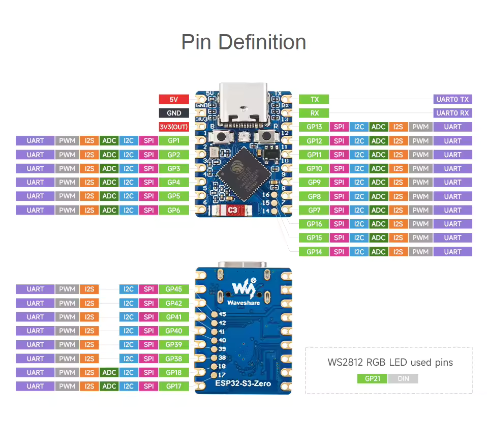

# ESP-FH4R2 – Web UI per LED RGB (ESP32‑S3 N4R2)

Questo progetto espone una semplice interfaccia web per controllare il LED RGB integrato della scheda tramite un color picker. I file statici (come `index.html`) sono serviti da SPIFFS, mentre un endpoint HTTP (`/color`) imposta il colore del NeoPixel onboard.

## Panoramica

- Web server su ESP32‑S3 (porta 80) con file statici da SPIFFS
- Pagina `index.html` con `<input type="color">` per scegliere il colore
- Endpoint `GET /color?hex=RRGGBB` per impostare il colore in tempo reale
- Utility: `GET /ls` per elenco file e `GET /fsinfo` per info filesystem

## Setup di Rete (Nuovo)

- Pagina `setup.html`: configurazione Wi‑Fi e rete dal browser.
  - Campi: SSID, password, DHCP oppure IP statico (IP, maschera, gateway, DNS).
  - Pulsanti: Salva (scrive `/config.json` su SPIFFS) e Riavvia.
- Link dalla home: in `index.html` è presente il link “apri setup”.
- All’avvio: la scheda legge automaticamente le impostazioni da `/config.json` (se presente) e le applica prima della connessione.
 - Se nessuna configurazione è presente: avvia un Access Point di setup (`ESP-FH4R2-Setup`, password `12345678`) per accedere a `setup.html`.

## Specifiche scheda ESP‑FH4R2 (ESP32‑S3 N4R2)

Nota: “N4R2” indica tipicamente 4 MB di Flash e 2 MB di PSRAM.

- MCU: ESP32‑S3 (dual‑core Xtensa LX7 fino a 240 MHz)
- Memoria: 4 MB Flash, 2 MB PSRAM
- Connettività: Wi‑Fi 2.4 GHz (802.11 b/g/n), Bluetooth LE 5
- USB: nativa (USB‑C) per programmazione e seriale
- LED RGB integrato (NeoPixel) controllato via `Adafruit_NeoPixel`
- File system SPIFFS per contenuti web
- I/O a 3.3 V

## Struttura del progetto

- `src/main.cpp`: logica firmware (Wi‑Fi, server HTTP, endpoint `/color` e gestione NeoPixel)
- `data/index.html`: interfaccia web servita da SPIFFS (color picker + JS)
- `data/setup.html`: pagina di configurazione rete (carica/salva via API)
- `data/config.json`: file di configurazione iniziale (usato al primo avvio dopo upload SPIFFS)
- `data/info.html`: pagina informazioni con visualizzazione di `fsinfo` e `ls`
- `data/archivio.html`: gestione file su SPIFFS (upload e cancellazione)
  - Mostra in fondo lo spazio SPIFFS: totale, occupato e libero (usa `/fsinfo`).
  - Dimensioni con separatori migliaia/milioni per una lettura più chiara.
  - All'apertura della pagina: LED a semaforo in base all'occupazione SPIFFS:
    - Verde: basso utilizzo
    - Giallo: ~50%
    - Rosso: >70%
  - Il LED si aggiorna automaticamente dopo upload e cancellazione file.
- `platformio.ini`: configurazione PlatformIO (env `adafruit_qtpy_esp32s3_n4r2`, SPIFFS, dipendenze)

## Build e Upload (PlatformIO)

1. Configura le credenziali Wi‑Fi in `src/main.cpp` (`WIFI_SSID`, `WIFI_PASS`).
2. Carica i file su SPIFFS:
   - `pio run -t uploadfs`
3. Flash del firmware:
   - `pio run -t upload`
4. Monitora la seriale (per IP e log):
   - `pio device monitor`
5. Apri il browser su `http://<ip_esp32>` e usa il color picker.
6. Per configurare la rete dal web, apri `http://<ip_esp32>/setup.html`.

> Suggerimento: dopo `uploadfs`, esegui un reset della board per assicurarti che i file vengano serviti correttamente.

## API HTTP

- `GET /color?hex=RRGGBB`
  - Parametro `hex`: colore in formato esadecimale a 6 cifre (senza `#`).
  - Risposta: `{"ok": true, "hex": "RRGGBB"}`

Esempio: `http://<ip_esp32>/color?hex=FF00AA`

### API Configurazione (Nuovo)

- `GET /api/get_config` → restituisce JSON con `dhcp`, `ssid`, `pass`, `ip`, `mask`, `gw`, `dns`.
- `POST /api/save_config` → accetta JSON con i campi sopra e salva su `/config.json`.
- `POST /api/reboot` → riavvia la scheda per applicare le nuove impostazioni.

## Pagina Web

La pagina `data/index.html` include:

- Un `<input type="color">` per scegliere il colore
- Un bottone “Spegni” (porta il LED a nero `#000000`)
- Script che invia la scelta a `/color` e mostra lo stato
- Un link alla pagina di setup rete

## Note

- Luminosità NeoPixel: impostata a un valore moderato in `setup()`; modifica se necessario.
- Pin NeoPixel: nel codice è impostato il pin 21 per il LED onboard; se la tua scheda usa un altro pin, modifica il costruttore `Adafruit_NeoPixel` in `src/main.cpp` oppure usa la costante `PIN_NEOPIXEL` se disponibile nel core.
- Le credenziali Wi‑Fi sono in chiaro in `src/main.cpp` per semplicità: valuta metodi più sicuri per ambienti reali.
- Configurazione persistente: salvata su SPIFFS in `/config.json` e caricata automaticamente all’avvio.

### Indicazioni LED

- Rosso: durante l’avvio in modalità STA fino al completamento della connessione Wi‑Fi.
- Blu: modalità Access Point di setup attiva.
- Spento: dopo la connessione in STA (completato l’avvio).

## Pinout

L’immagine seguente mostra il pinout della scheda (file incluso nel repo):

- `GET /ls` → restituisce elenco file su SPIFFS (testo). Usato da `info.html`.
- `GET /fsinfo` → restituisce info spazio usato/total e presenza `index.html` (testo). Usato da `info.html`.
 - `POST /api/delete` → elimina un file. Body `path=/nomefile` (x-www-form-urlencoded). Usato da `archivio.html`.
 - `POST /upload` → upload file (multipart/form-data). Usato da `archivio.html`.
 - `GET /api/download?path=/file` → scarica un file forzando il download (Content-Disposition). Usato da `archivio.html`.
